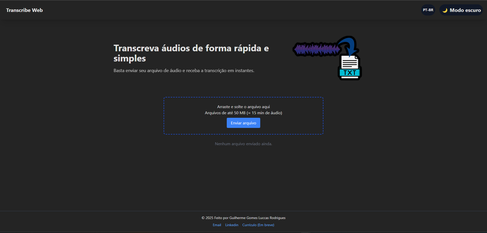

# TranscribeWEB
`finalizado`

# 📝 Descrição do projeto
Esse projeto consiste em uma plataforma web capaz de retornar a transcrição e um resumo feito por uma API utilizando IA;

# 🔨 Funcionalidades
- `Enviar um áudio`: O front-end feito em React com typeScript permite o envio de arquivos de áudio por meio do componente dropzone;
  
- `Trocar língua`: Localizado no header do site, há uma opção para trocar a linguagem entre PT-BR e ENG;

- `Trocar tema`: Localizado no header do site, existe a opção de troca de tema, possibilitando a troca entre temas "dark' e 'light';

# 📖 Aprendizados
- Utilização do componente Dropzone
- Utilização do framework react-i18next para a troca de linguagem dinâmica do site
- Utilização eficaz do tailwind css
- Tornar o código principal mais limpo

# 🖥️ Onde acessar o projeto
<a href="https://transcribewebfrontend.vercel.app/">CLique aqui para visualizar o projeto</a>

